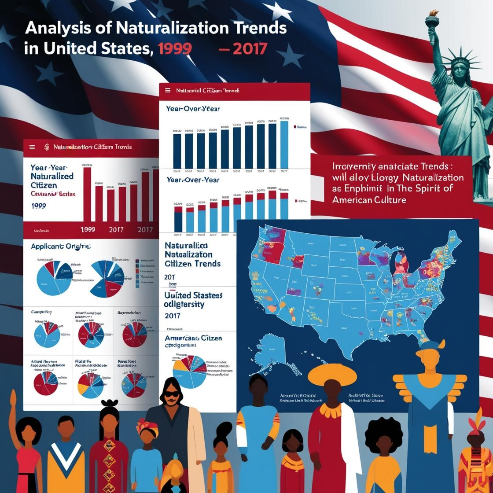

---

### **Project: Analysis of Naturalization Trends in the United States**

---

### **Project Description:**

This project aims to analyze naturalization data in the United States from 1999 to 2017 to understand the patterns and factors influencing the acquisition of U.S. citizenship.

By examining factors such as:

- **Yearly trends**
- **Types of naturalization**
- **Countries or regions of origin**

we seek to uncover insights that can support policymakers and researchers in understanding demographic shifts and the potential impacts of immigration on American society.

---

### **Objectives:**

1. **Data Cleaning:**
   - Handle missing values to ensure a clean dataset for analysis.

2. **Data Visualization:**
   - Create visualizations to explore key trends and patterns in naturalization data.
   - Focus on factors that may influence naturalization rates.

3. **Encoding and Normalization:**
   - Prepare categorical and numerical data for future predictive models or more in-depth analyses.

---

### **Dataset Overview:**

The dataset provides comprehensive information about naturalization trends in the United States, including details such as:

- **Year**: The year of naturalization.
- **Type**: The type of naturalization (e.g., new vs. derivative).
- **Naturalization**: The total number of naturalizations.
- **Country or Region**: The country or region of origin of the immigrants.

This information serves as a foundation for analyzing naturalization trends and immigrant preferences over various periods.

---

### **Analysis Steps:**

⓵ **Data Cleaning:**
   - Address missing values and identify outliers to ensure data quality.

⓶ **Data Visualization:**
   - Generate visual representations to explore patterns and trends in naturalization data.

⓷ **Encoding:**
   - Transform categorical data into a suitable format for analysis.

⓸ **Normalization:**
   - Scale numerical features to standardize data for further analysis.

⓹ **Answer Key Business Questions:**

   - What are the primary countries or regions contributing to the increase in naturalizations in the U.S. over the studied period (1999-2017)?
   
   - How have changes in immigration policy affected the number of naturalizations per year?

---

### **Required Libraries:**

- **pandas**
- **matplotlib**
- **seaborn**
- **sklearn**

---
